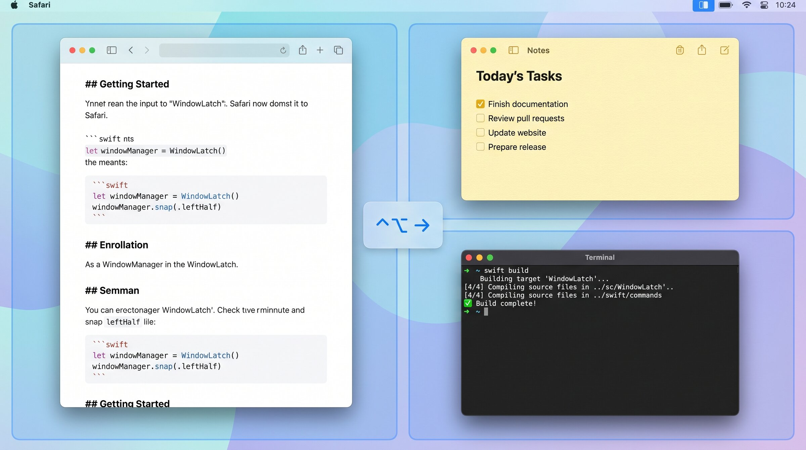

# WindowLatch — a free, open-source window manager for macOS

**A fast, focused window manager for macOS.**

Cycle the focused window through ⅔ → ½ → ⅓ zones with one keyboard shortcut per direction. Combine directions for quadrants. Jump across monitors when you run out of room. Inspired by Microsoft PowerToys' **FancyZones**.

## Why WindowLatch

- **It cycles the right way.** Press `⌃⌥ ←` once → left ⅔. Again → left ½. Again → left ⅓. Stop guessing which keystroke gives you which size.
- **It works across monitors.** When the cycle exhausts, the window leaps to the next display. Press the opposite arrow within 1.5 s to snap straight back.
- **It does directional combos.** `⌃⌥ ←` then `⌃⌥ ↑` = top-left quadrant. No extra keys to memorise.
- **It respects each monitor.** Configure halves / thirds / quarters independently per display — your ultrawide and your 4K don't have to agree.
- **It's a 400 KB download.** Native Swift + AppKit. No Electron, no background daemons, no analytics.
- **It's MIT-licensed and open source.** Read the code. Fork it.

## Download

[**⬇ Get the latest release**](https://github.com/fabiomsnunes/WindowLatch/releases/latest) — single `.dmg`, ad-hoc signed.

Requires **macOS 26 (Tahoe)** or later, Apple Silicon or Intel.
[](https://github.com/fabiomsnunes/WindowLatch/releases/latest)
[](LICENSE)
[](#install)
[](https://swift.org)



## Default shortcuts

| Action      | Shortcut |
| ----------- | -------- |
| Cycle Left  | ⌃⌥ ←     |
| Cycle Right | ⌃⌥ →     |
| Cycle Up    | ⌃⌥ ↑     |
| Cycle Down  | ⌃⌥ ↓     |

The modifier is reconfigurable in Settings (Ctrl+Option, Ctrl+Cmd, Cmd+Option, or Ctrl+Cmd+Shift). The arrow keys are fixed.

## Features

- **Cycle:** `⅔ → ½ → ⅓` in any direction. Press the same arrow until the size feels right.
- **Cross-monitor jump:** at cycle exhaustion, the window leaps to the adjacent display.
- **Jump-back:** press the opposite arrow within 1.5 s to return to the original monitor.
- **Reverse cycle:** press the opposite arrow to step back through the previous direction's sequence.
- **Directional combos:** `⌃⌥ ←` then `⌃⌥ ↑` within 1.5 s = top-left quadrant.
- **Per-monitor zone configuration:** enable/disable halves, thirds, and quarters independently per display.
- **Configurable** gap, cycle reset delay, and modifier key.
- **Menu-bar app** — no Dock clutter.

## Install

### From GitHub Releases (recommended)

1. Download `WindowLatch-vX.Y.Z.dmg` from [Releases](https://github.com/fabiomsnunes/WindowLatch/releases/latest).
2. Open the `.dmg` and drag **WindowLatch** to `/Applications`.
3. First launch: double-click WindowLatch. Gatekeeper will block it (the build is ad-hoc signed, not notarised). Open **System Settings → Privacy & Security**, scroll to the "WindowLatch was blocked…" notice and click **Open Anyway**, then confirm in the dialog.
4. Grant **Accessibility** when prompted (see below).

### Build from source

```bash
git clone https://github.com/fabiomsnunes/WindowLatch.git
cd WindowLatch
open WindowLatch.xcodeproj
# ⌘R in Xcode
```

Requires Xcode 16 or later, deployment target macOS 26 (Tahoe).

## Accessibility permission

WindowLatch needs **Accessibility** to move and resize windows of other apps — it's the only API macOS exposes for this. The app reads window positions and updates them when you press a shortcut. Nothing else is read or transmitted.

On first launch the onboarding screen explains this and links to the right pane:

**System Settings → Privacy & Security → Accessibility → toggle WindowLatch on.**

The app detects the change automatically — no restart needed.

## Roadmap

- **Drag & snap with zone overlay** _(next)_ — hold a modifier key while dragging a window to reveal a FancyZones-style overlay highlighting the available zones; release to snap.

Have an idea? [Open an issue](https://github.com/fabiomsnunes/WindowLatch/issues).

## Limitations

- **Electron / non-native apps** (VS Code, Slack, Discord) sometimes resist `setSize` and snap back. Native apps and well-behaved Cocoa apps work perfectly.
- **Fullscreen Spaces:** WindowLatch can't move a window that's currently in a dedicated fullscreen Space. Exit fullscreen first.
- **Screen Recording-style apps** that take over the display may capture global shortcuts before WindowLatch sees them.

## Architecture

- **Swift 6** + **SwiftUI** (Settings) + **AppKit** (menu bar, windows)
- **Accessibility API** for window manipulation
- [**KeyboardShortcuts**](https://github.com/sindresorhus/KeyboardShortcuts) by Sindre Sorhus for global hotkeys
- Pure `CycleEngine` state machine — fully unit-tested, no AX or `Date.now` dependency
- `ScreenAdjacency` is a pure helper — also unit-tested
- Hybrid persistence: UserDefaults (gap, delay, modifier) + JSON (per-monitor zone groups)

## Contributing

PRs welcome. Before committing, run:

```bash
swiftformat .
xcodebuild test -scheme WindowLatch -destination 'platform=macOS' -only-testing:WindowLatchTests
```

CI runs SwiftFormat lint on every PR. Tests must pass locally before cutting a release tag.

## FAQ

**How is this different from Rectangle, Magnet, or Moom?**
The cycle behaviour. WindowLatch presses the same arrow repeatedly to step through `⅔ → ½ → ⅓` — Rectangle and Magnet require separate shortcuts for each size, Moom needs you to open a palette. WindowLatch also auto-jumps to the next monitor when the cycle exhausts, which none of them do natively.

**Does it phone home?**
No. There is no network code in the app.

**Will it work on macOS 15 or earlier?**
Not in this release. The deployment target is macOS 26 (Tahoe). Backporting is possible but not planned.

**Why ad-hoc signed instead of notarised?**
Apple Developer notarisation costs €99/year for a personal-use, free app. Ad-hoc signing means one extra Gatekeeper click on first launch, then it's invisible.

## License

[MIT](LICENSE) — © 2026 Fábio Nunes.

## Acknowledgements

Inspired by Microsoft PowerToys **FancyZones**. Built on top of Sindre Sorhus's **KeyboardShortcuts**.
